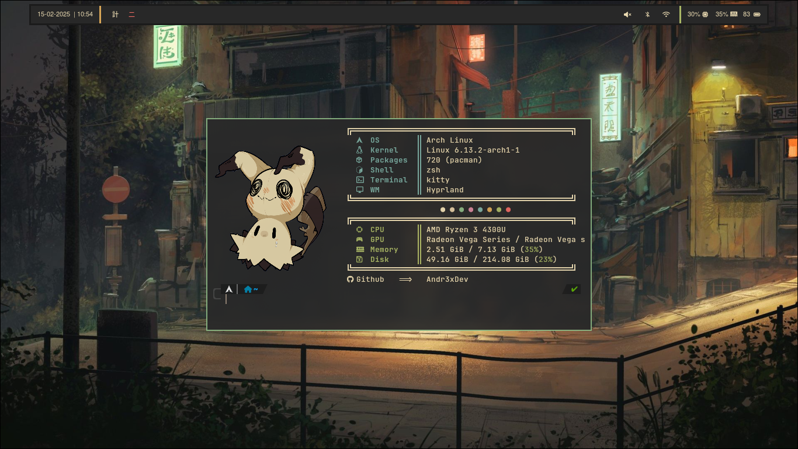
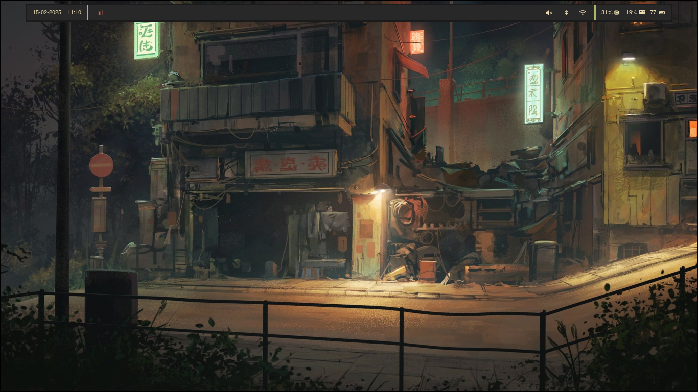
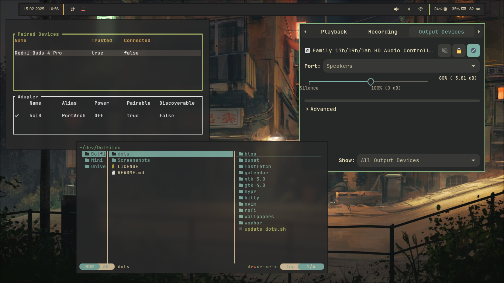
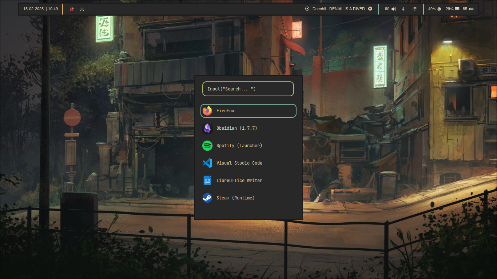
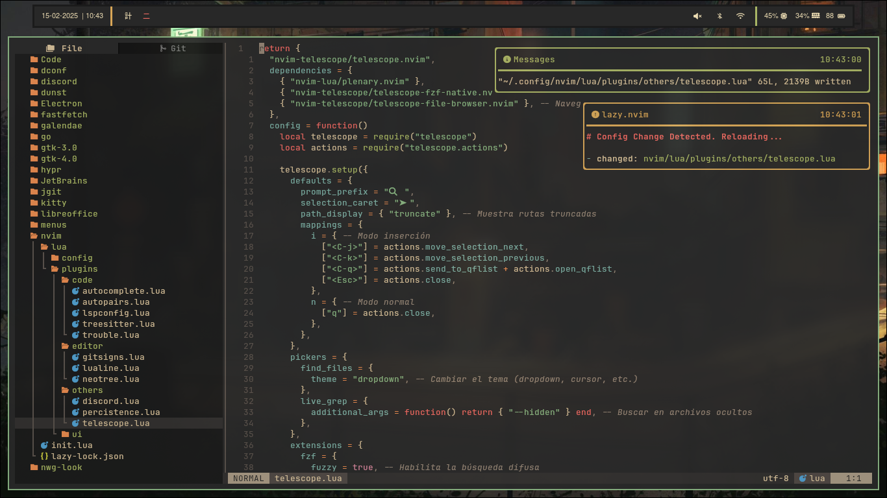
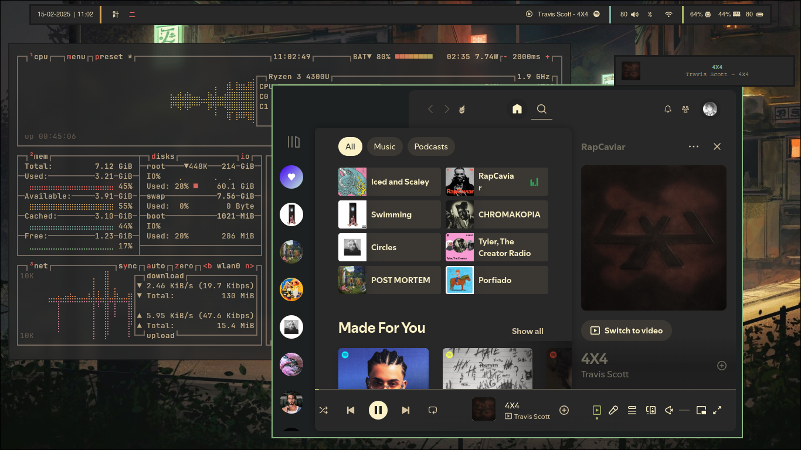
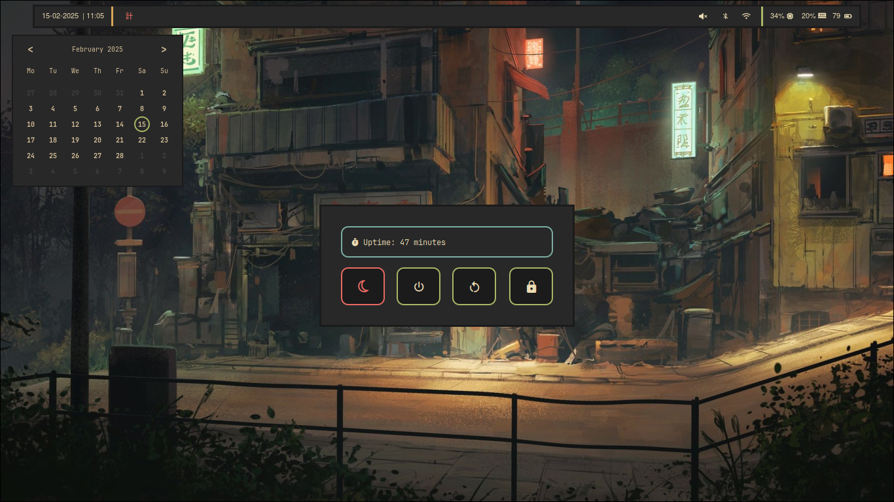

<div align="center">
    <h1 align="center">HyprPharch</h1>
    <p align="center">
Andr3x's Hyprland Dotfiles but functional Arch Linux setup with 
    </p>
</div>

</br>

## About The Project

This configuration is focused on having only the essential visual and practical elements, which are also lightweight and consume the least amount of resources. It has a sober and **minimalist style** that focuses on productivity without sacrificing a clean and calm aesthetic.

</br>

## Screenshots

-   Overview:



<details>
    <summary>Other images</summary>













</details>

</br>

## Resume

### Aps

This are all basic apps i use

| Categoría         | Aplicación      |
| ----------------- | --------------- |
| **Compositor**    | Hyprland        |
| **Terminal**      | Kitty           |
| **Shell**         | Zsh             |
| **Editor**        | Neovim / VScode |
| **Notifications** | Dunst           |
| **Menu**          | Rofi-wayland    |
| **Bar**           | Waybar          |
| **Calendar**      | WORKING         |
| **Bluethoot**     | Bluetui         |
| **Network**       | nmtui           |
| **Sound control** | Pavucontrol     |

### Keyblinds

WORKING

</br>

## Getting Started

To obtain this configuration, there are **two options**. The first one is through a script, and the other one is manually, depending on what you want to have in your config.

### Automatic installation

This script will install all the dependencies and packages necessary to copy the complete configuration. Ideal to have an exact version of this configuration.

1. Clone the repo

    ```sh
    git clone https://github.com/Andr3xDev/HyprPharch
    ```

2. Run the installation script

    ```sh
     cd HyprPharch/scripts
    ./install.sh
    ```

3. Continue the installation, completing what the script asks for

### Manual installation

You can copy the configurations that interest you and also see what package and dependencies you need.

1. Clone the repo.

    ```sh
    git clone https://github.com/Andr3xDev/HyprPharch.git
    ```

2. Copy target config.
    ```sh
    cd HyprPharch/dots
    cp -r <Target config> ¬/.config/
    ```
3. Filter and install the packages you need.

    ```sh
    sudo pacman -S --noconfirm --needed hyprland hyprpaper hyprlock hypridle kitty 7zip bluetui brightnessctl btop dunst fastfetch firefox fzf gtk-engine-murrine neovim noto-fonts-cjk nwg-look papirus-icon-theme pavucontrol pipewire pipewire-alsa pipewire-jack pipewire-pulse polkit-gnome python python-gobject rofi-wayland spotify-launcher ttf-firacode-nerd ttf-font-awesome ttf-jetbrains-mono-nerd unzip waybar wireplumber xdg-desktop-portal-hyprland xdg-utils yazi zsh
    ```

    ```sh
    paru -S --noconfirm --needed bibata-cursor-theme-bin spicetify-cli visual-studio-code-bin
    ```

</br>

## License

Distributed under the Unlicense License. See `LICENSE` for more information.
